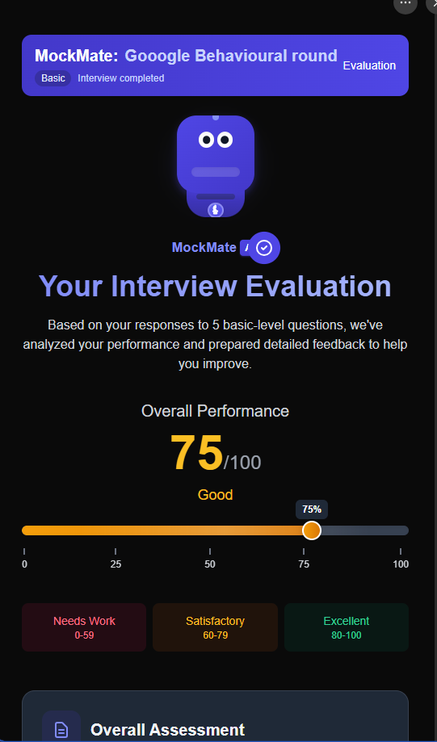

# MockMate - AI-Powered Technical Interview Practice

MockMate is an interactive technical interview practice platform powered by AI that helps developers prepare for technical interviews through realistic conversation-based practice sessions.Sharpen your interview skills, prepare with AI-powered practice. and Evaluate  your skills
Any Skill, Any Difficulty

Please Give It a try:
[https://mock-mate-v2.netlify.app/](https://https://mock-mate-v2.netlify.app/)
Completely free, no login required
(Use your desktop with a headphone for better experience)

By: Team CodeMonk
Connect with me: [https://www.linkedin.com/in/mr-gyan491/](https://www.linkedin.com/in/mr-gyan491/)




## Features

- 🎯 **Skill-Based Practice**: Choose from popular programming languages and technologies
- 🔄 **Dynamic Difficulty Levels**: Basic, Intermediate, Advanced, or Mixed question sets
- 🎙️ **Voice Interaction**: Natural conversation with speech recognition and synthesis
- 📊 **Real-Time Feedback**: Immediate analysis and scoring of your responses
- 🤖 **AI-Powered Evaluation**: Detailed feedback on strengths and areas for improvement
- 🌗 **Dark Mode Support**: Comfortable practice experience in any lighting condition

## Getting Started

### Prerequisites

- Node.js (v18 or higher)
- Google AI (Gemini) API Key

### Installation

1. Clone the repository:

```bash
git clone https://github.com/Gyana491/mockmate-v2.2
cd mockmate-v2.2
```

2. Install dependencies:

```bash
npm install
```

3. Create a `.env` file in the root directory:

```env
NEXT_PUBLIC_GEMINI_API_KEY=<Your Gemini API Key>
```

4. Start the development server:

```bash
npm run dev
```

5. Open [http://localhost:3000](http://localhost:3000) in your browser

## Technology Stack

- **Frontend**: Next.js 14, React, TailwindCSS
- **UI/UX**: Framer Motion for animations
- **AI Integration**: Google Gemini AI API
- **Speech Processing**: Web Speech API
- **Styling**: TailwindCSS with custom animations

## Key Components

- **Interview Panel**: Core interview interface with real-time interaction
- **Voice Recognition**: Natural speech input processing
- **AI Evaluation**: Real-time response analysis and feedback
- **Score Analytics**: Detailed performance metrics and insights

## Environment Variables


| Variable                     | Description                     |
| ---------------------------- | ------------------------------- |
| `NEXT_PUBLIC_GEMINI_API_KEY` | Your Google AI (Gemini) API key |

## Features in Detail

### Interview Flow

1. Select your target skill and difficulty level
2. Choose the number of questions
3. Engage in voice-based conversation
4. Receive immediate feedback and scoring
5. Get detailed performance evaluation

### Question Types

- Basic: Beginner-friendly conceptual questions
- Intermediate: Practical implementation scenarios
- Advanced: Complex system design and architecture
- Mixed: Combination of difficulty levels

## Contributing

Contributions are welcome! Please feel free to submit a Pull Request.

Connect with me: [https://www.linkedin.com/in/mr-gyan491/](https://www.linkedin.com/in/mr-gyan491/)
